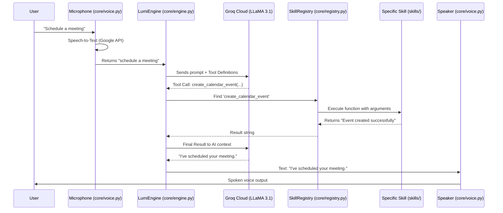
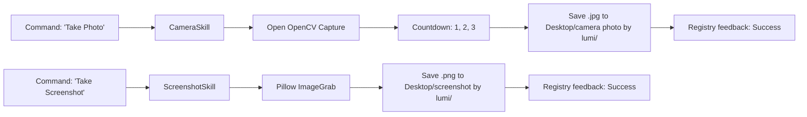

# 📊 LUMI Backend & N8N Workflow Diagrams

This document visualizes the "internal clockwork" of LUMI, showing how data moves from your voice to the local system and the N8N cloud.

---

## 1. The Global Voice-to-Action Workflow
This diagram shows the "Main Loop" from the moment you speak to the moment LUMI responds.



---

## 2. N8N Integration Depth (The Webhook Bridge)
This flowchart shows exactly how LUMI jumps from your PC to the N8N Server.

```mermaid
graph TD
    A[Voice Command Recognized] --> B{Is it a Cloud Task?}
    B -- Yes --> C[skills/n8n_skill.py]
    B -- No --> D[Internal Skills like Camera/System]
    
    subgraph LUMI Backend (Local PC)
    C --> E[Prepare JSON Payload]
    E --> F[HTTP POST Request]
    end
    
    subgraph Cloud Logic (n8n.cloud)
    F -- Webhook URL --> G[n8n Webhook Node]
    G --> H{Action Type?}
    H -- calendar --> I[Google Calendar Node]
    H -- task --> J[Google Tasks Node]
    H -- telegram --> K[Telegram Node]
    end
    
    I --> L[Return 200 OK / Success]
    J --> L
    K --> L
    
    L -- Response Body --> M[LUMI Local Engine]
    M --> N[Speak Confirmation to User]
```

---

## 3. The File-System & Vision Flow
How LUMI handles high-priority local media tasks.



---

## 4. Summary of Data Paths

| Data Type | Source | Processing | Destination |
|-----------|--------|------------|-------------|
| **Human Voice** | Microphone | Google STT | Plain Text String |
| **Logic/Intent** | Plain Text | Groq LLM | Tool/Function Name |
| **Cloud Tasks** | JSON Object | n8n.cloud | Third-Party APIs (Google/Telegram) |
| **System Commands** | Python Code | PowerShell/API | Local Windows Hardware |
| **Audio Output** | Text Result | pyttsx3 (SAPI5) | User Speakers |

---

*Visualization generated for Joel M - February 24, 2026*
